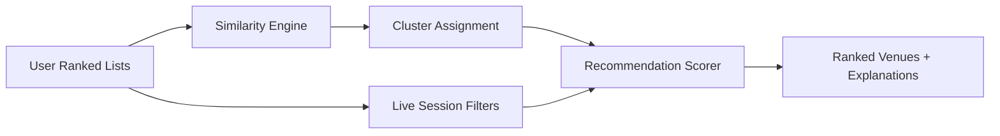
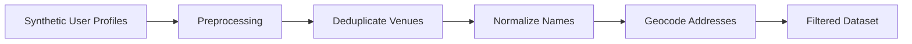

# Cluster Architecture Planning Document — taste.node

## Table of Contents

1. [Overview](#overview)
2. [Similarity Engine Design](#1-similarity-engine-design)
3. [Clustering Strategy](#2-clustering-strategy)
4. [Tag Schema, Values, and Weights](#3-tag-schema-values-and-weights)
5. [Recommendation Scoring Formula](#4-recommendation-scoring-formula)
6. [Tools and Libraries](#5-tools-and-libraries)
7. [Edge Cases and Trade-offs](#6-edge-cases-and-trade-offs)
8. [Appendix: Full Formulas](#appendix-full-formulas)

---

## Overview

The taste.node clustering system is a hybrid recommendation engine that combines **list-based collaborative filtering** with **content-based session filtering**. 



---

## 1. Similarity Engine Design

### 1.1 Primary Similarity Metric: Rank-Biased Overlap (RBO)

**Why RBO?**
- Handles **lists of different lengths** (User A has top-5, User B has top-10)
- Handles **partial overlap** (only 2–3 shared venues)
- Weights **top ranks more heavily** via parameter `p`
- Bounded between 0 and 1

**Formula:**

```
RBO(S, T, p) = (1 - p) * Σ[d=1 to ∞] p^(d-1) * A_d
```

Where:
- `S`, `T` are the two ranked lists
- `p` = depth persistence parameter (default: 0.9)
  - `p=0.9` means top ranks matter ~10x more than rank 10+
  - `p=0.7` emphasizes top-3 heavily
- `A_d` = agreement at depth `d` = |{S[1:d] ∩ T[1:d]}| / d

**Example:**

User A: [Ramen-Ya, Burger-No1, Sushi-Zen, Pasta-Bella, Tacos-Locos]
User B: [Ramen-Ya, Sushi-Zen, Pizza-Napoli, Burger-No1, Curry-Hut]

```
d=1: {Ramen-Ya} ∩ {Ramen-Ya} = 1/1 = 1.0
    contrib: (1-0.9)*0.9^0*1.0 = 0.1
d=2: {Ramen-Ya, Burger-No1} ∩ {Ramen-Ya, Sushi-Zen} = 1/2 = 0.5
    contrib: 0.1*0.9*0.5 = 0.045
d=3: {Ramen-Ya, Burger-No1, Sushi-Zen} ∩ {Ramen-Ya, Sushi-Zen, Pizza-Napoli} = 2/3 ≈ 0.667
    contrib: 0.1*0.81*0.667 = 0.054
...
RBO ≈ 0.67 (strong taste similarity)
```

### 1.2 Secondary Metric: Normalized Kendall Tau Distance (Tau-b)

Used when:
- Both lists have identical sets (complete overlap)
- Linear rank correlation is meaningful
- RBO returns near-1 and needs confirmation

**Formula:**

```
τ_b = (P - Q) / sqrt((n_0 - n_1)(n_0 - n_2))
```

Where:
- `P` = number of concordant pairs
- `Q` = number of discordant pairs
- `n_0` = total pairs
- `n_1`, `n_2` = ties penalty
- Normalized to `sim_τ = (τ_b + 1) / 2` to range [0,1]

### 1.3 Tertiary Metric: Jaccard Index (Set-Based)

Used when:
- RBO is unreliable due to extremely sparse overlap (< 2 venues)
- Quick pre-filtering step (if Jaccard < 0.1, skip detailed comparison)

**Formula:**

```
sim_J = |A ∩ B| / |A ∪ B|
```

### 1.4 Hybrid Combined Similarity

**Final similarity score:**

```python
def compute_similarity(list_a, list_b):
    # Quick rejection
    if jaccard(list_a, list_b) < 0.1:
        return 0.0
    
    # Primary: RBO
    rbo_sim = rbo(list_a, list_b, p=0.9)
    
    # If complete overlap, boost with Kendall
    if set(list_a) == set(list_b):
        tau_sim = (kendall_tau(list_a, list_b) + 1) / 2
        return 0.7 * rbo_sim + 0.3 * tau_sim
    
    return rbo_sim
```

### 1.5 Handling Partial Overlap

**Strategy:** `Length-Agnostic RBO`

```python
def rbo(list_a, list_b, p=0.9):
    """
    Extends shorter lists conceptually to max length.
    Unmatched items in longer list still contribute to overlap
    proportionally at deeper ranks.
    """
    max_len = max(len(list_a), len(list_b))
    # Implicit: missing items are "empty" — no penalty for truncation
    # Only rank positions present in BOTH lists matter
    return rbo_with_extension(list_a, list_b, max_len, p)
```

**Minimum viable overlap:**
- `sim > 0.3` requires at least 2 shared items in top-5
- `sim > 0.5` requires 3+ shared items OR 2 shared in exact same rank
- `sim > 0.7` requires 3+ shared items with 2 in same position

### 1.6 Weighting by Rank Depth

**Exponential decay model:**

The `p` parameter in RBO already encodes this: `p=0.85` means rank-1 weight ≈ 1.0, rank-5 ≈ 0.44, rank-10 ≈ 0.20

**Per-rank weight table (p=0.9):**

| Rank | Normalized Weight | Cumulative Importance |
|------|------------------|----------------------|
| 1    | 0.100            | 10.0%                |
| 2    | 0.090            | 19.0%                |
| 3    | 0.081            | 27.1%                |
| 5    | 0.066            | 40.9%                |
| 10   | 0.035            | 61.3%                |
| 20   | 0.012            | 78.8%                |

---

## 2. Clustering Strategy

### 2.1 Algorithm Selection: Agglomerative Hierarchical Clustering (AHC)

**Why not K-Means?**
- Taste similarity is NOT in Euclidean space
- Users don't distribute into spherical clusters with equal variance
- Hard to pre-specify K for small MVP
- Cannot use standard centroid computation on ranked lists

**Why Agglomerative Hierarchical?**
- Native support for custom distance metrics (1 - RBO similarity)
- Natural cluster count discovery via dendrogram cutoff
- Produces tree structure for nested taste groups
- Allows "soft" cluster membership at merge thresholds

**Distance metric:**

```python
d(A, B) = 1 - compute_similarity(A, B)
```

**Linkage method:** `average` linkage
- Compromise between `single` (too permissive, chain effect) and `complete` (too strict)
- Average pairwise similarity between all members of two clusters

```python
from scipy.cluster.hierarchy import linkage, fcluster
from scipy.spatial.distance import squareform

# sim_matrix: N x N user similarity matrix
dist_matrix = 1 - sim_matrix
dist_condensed = squareform(dist_matrix, checks=False)
Z = linkage(dist_condensed, method='average')
clusters = fcluster(Z, t=0.5, criterion='distance')  # merge threshold
```

**Alternative for larger scale: Spectral Clustering**
- Only if > 500 seed users and dimensionality is high
- Uses similarity matrix as affinity graph
- Preferred when clusters are non-convex in distance space

### 2.2 Dynamic Re-Clustering Strategy

**Trigger-based (not scheduled):**

| Trigger | Action | Latency Target |
|---------|--------|----------------|
| User adds venue to list | Incremental cluster update only for that user | < 500ms |
| User reorders list | Recompute user's cluster assignment | < 500ms |
| New user joins (≥3 items) | Full membership evaluation | < 1s |
| Daily batch (02:00 UTC) | Full re-clustering + seed refresh | < 5 min background |
| Cluster quality drops | Alert + re-cluster | Background |

**Incremental Update Algorithm:**

```python
def on_user_list_change(user_id):
    user = get_user(user_id)
    cluster = get_current_cluster(user)
    
    # Compute similarity to cluster centroid (median list)
    sim_to_cluster = rbo(user.list, cluster.median_list)
    
    if sim_to_cluster < 0.4:
        # Search all clusters for better fit
        best_cluster = argmax(rbo(user.list, c.median_list) for c in all_clusters)
        if best_cluster.sim > 0.5:
            move_user(user, best_cluster)
        else:
            # Form new micro-cluster
            new_cluster = create_cluster([user])
            if len(new_cluster.members) >= 3 after 24h:
                promote_to_full_cluster(new_cluster)
```

### 2.3 Seed Cluster Construction Pipeline

**Phase 1: Data Ingestion**



**Filtering criteria for seed users:**
- Minimum 3 venues in ranked list
- At least 2 venue categories represented (avoids single-cuisine outliers)
- Active account indicator (not abandoned)
- Geographic clusterability (at least 50 users in same metro area)

**Phase 2: Pairwise Similarity**
- Compute RBO for all pairs of seed users
- For N=500 seed users: 124,750 pairwise comparisons
- Parallelize with joblib or multiprocessing
- Cache in `sim_matrix.npy`

**Phase 3: Hierarchical Clustering**
- Run AHC on full seed dataset
- Determine cutoff threshold by Silhouette score sweep:

```python
def find_optimal_cutoff(sim_matrix, Z):
    best_sil = -1
    best_t = 0.5
    for t in np.arange(0.3, 0.8, 0.05):
        labels = fcluster(Z, t=t, criterion='distance')
        sil = silhouette_score(1-sim_matrix, labels, metric='precomputed')
        if sil > best_sil:
            best_sil, best_t = sil, t
    return best_t, best_sil
```

**Target:** Silhouette > 0.4

**Phase 4: Cluster Annotation**
- For each cluster, compute:
  - Median ranked list (venue at each rank position by plurality)
  - Top-3 dominant cuisines
  - Geographic centroid
  - Price tier distribution
- Generate human-readable label: "Ramen enthusiasts in Downtown", "Fine-dining explorers", etc.

### 2.4 Cold-Start Handling

**New user with <3 items:**
1. Cannot join a cluster yet
2. Gets "explorer" status — recommendations based on venue popularity + filter match only
3. Encouraged to add 3+ venues to unlock cluster recommendations
4. Shows "Add 2 more favorites to get personalized recs" in UI

**New user with 3–5 items:**
1. Compute similarity to ALL cluster medians
2. Assign to best cluster if sim > 0.45
3. If no cluster exceeds 0.45, create "micro-cluster" singleton
4. Singletons are grouped overnight if 3+ singletons have mutual similarity > 0.5

---

## 3. Tag Schema, Values, and Weights

### 3.1 Venue Metadata Taxonomy

#### Core Fields

```python
class VenueMetadata:
    venue_id: str           # UUID v4
    name: str               # Normalized venue name
    location: GeoPoint      # lat, lng
    address: str            # Human-readable
    city: str
    
    # CUISINE (multiple allowed)
    cuisines: List[str]     # See taxonomy below
    primary_cuisine: str    # Most representative
    
    # DIETARY support
    dietary_tags: List[str] # See taxonomy below
    
    # HEALTH & QUALITY
    health_score: float     # 0.0 - 1.0, composite (see formula)
    
    # PRICE
    price_tier: int         # 1=$, 2=$$, 3=$$$, 4=$$$$
    
    # AMBIANCE (optional, filterable)
    ambiance: List[str]     # ["casual", "fine-dining", "family", "romantic", "date-night", "lively"]
    
    # BUSINESS
    is_open: bool
    hours: Dict[str, Tuple[time, time]]
    
    # VALIDATION
    source_tags: List[str]  # ["synthetic", "user-submitted", "curated", "api"]
    confidence: float       # 0.0 - 1.0 data quality score
```

#### Cuisine Taxonomy (42 types, hierarchical)

```
Cuisine
├── Asian
│   ├── Chinese
│   │   ├── Cantonese
│   │   ├── Sichuan
│   │   └── Dim Sum
│   ├── Japanese
│   │   ├── Sushi
│   │   ├── Ramen
│   │   └── Izakaya
│   ├── Korean
│   ├── Thai
│   ├── Vietnamese
│   └── Indian
│       ├── North Indian
│       └── South Indian
├── European
│   ├── Italian
│   │   ├── Pizza
│   │   ├── Pasta
│   │   └── Fine Italian
│   ├── French
│   ├── Spanish
│   └── Mediterranean
├── American
│   ├── Burgers
│   ├── BBQ
│   ├── Steakhouse
│   └── Soul Food
├── Middle Eastern
├── African
├── Latin American
│   ├── Mexican
│   ├── Peruvian
│   └── Brazilian
├── Healthy / Diet-Specific
│   ├── Salad / Bowls
│   ├── Vegan (cuisine-type)
│   ├── Vegetarian (cuisine-type)
│   └── Raw Food
└── Other
    ├── Fusion
    ├── Seafood (non-cuisine specific)
    └── Brunch / Breakfast
```

**Matching strategy:**
- Leaf nodes are preferred for storage
- Parent nodes can be matched via ancestry traversal
- Example: "Sushi" matches query for "Japanese" AND "Asian"

#### Dietary Tags (Boolean / Multi-select)

| Tag | Meaning | Detection |
|-----|---------|-----------|
| `diet-vegetarian` | Vegetarian options clearly available | Menu keyword + user tag |
| `diet-vegan` | Vegan options clearly available | Menu keyword + user tag |
| `diet-gluten-free` | GF options marked | Menu keyword |
| `diet-dairy-free` | Dairy-free options | Menu keyword |
| `diet-keto` | Low-carb friendly | Menu keyword |
| `diet-halal` | Halal certified/options | User tag + listing |
| `diet-kosher` | Kosher certified/options | User tag + listing |
| `diet-pescatarian` | Seafood-forward, meat-light | Menu analysis |
| `diet-low-carb` | Explicit low-carb options | Menu keyword |
| `diet-spicy` | Spicy food options | Menu keyword |
| `diet-mild` | Mild options available | Menu keyword |

#### Health Score Formula

```python
def compute_health_score(venue):
    """
    Composite 0-1 score based on available signals.
    """
    score = 0.0
    
    # Fresh/whole ingredient mentions (0.0-0.3)
    score += keyword_score(menu_text, HEALTH_KEYWORDS) * 0.3
    
    # Dietary option diversity (0.0-0.2)
    score += (len(venue.dietary_tags) / 10) * 0.2  # max at 10 tags
    
    # Trans-fat / processed food mentions (negative, 0.0-0.2)
    score -= keyword_score(menu_text, UNHEALTHY_KEYWORDS) * 0.2
    
    # User health-conscious engagement (0.0-0.3)
    health_users = [u for u in venue.visitors if u.health_pref == 'high']
    if venue.total_visitors > 0:
        score += (len(health_users) / venue.total_visitors) * 0.3
    
    return clamp(score, 0.0, 1.0)
```

**Normalization:**
- If from synthetic source with no menu text → `health_score = None` (treated as neutral 0.5 during filtering)

### 3.2 Profile vs Session-Level Tags

| Domain | Profile-Level (Persistent) | Session-Level (Ephemeral) |
|--------|---------------------------|--------------------------|
| Cuisines | Top-3 preferred cuisines from ranked list inference | "I want Italian tonight" |
| Dietary | Default dietary restrictions (vegan, halal) | "Feeling like seafood" |
| Health | General preference: balanced / indulgent / strict | "Eating clean this week" |
| Price | Comfortable price tier based on list venues | "Splurging tonight" |
| Location | Home/work addresses | "Near me now" radius slider |
| Ambiance | Preferred settings from ranked list | "Date night" / "Casual quick bite" |
| Time | Typically active hours | "Brunch" vs "Dinner" |

**Profile inference:**

```python
def infer_user_profile(user):
    profile = {}
    venues = [get_venue(v) for v in user.ranked_list]
    
    # Top cuisines by frequency in list, weighted by rank
    cuisine_counter = Counter()
    for rank, venue in enumerate(venues, 1):
        for cuisine in venue.cuisines:
            cuisine_counter[cuisine] += 1.0 / rank  # rank-1 = 1.0, rank-2 = 0.5, ...
    profile['preferred_cuisines'] = cuisine_counter.most_common(3)
    
    # Dietary: if 50%+ of list venues have tag, assume preference
    for tag in ALL_DIETARY_TAGS:
        ratio = sum(1 for v in venues if tag in v.dietary_tags) / len(venues)
        if ratio >= 0.5:
            profile['dietary_restrictions'].append(tag)
    
    # Price tier: median of list
    profile['price_comfort'] = median(v.price_tier for v in venues)
    
    return profile
```

### 3.3 Tag Weighting Strategy (Recommendation Scoring)

Final recommendation score is a weighted sum:

```
score = w_cluster * cluster_score + 
        w_filter * filter_score + 
        w_surprise * surprise_bonus +
        w_trend * trend_bonus

Where w_cluster + w_filter + w_surprise + w_trend = 1.0
```

**Default weights:**

| Component | Weight | Rationale |
|-----------|--------|-----------|
| **Cluster affinity** | 0.45 | Core value prop — people like you loved this |
| **Filter match** | 0.35 | Respect user's current intent |
| **Surprise** | 0.15 | Surface unexpected gems outside obvious matches |
| **Trend** | 0.05 | Light boost for recently popular in area |

**Dynamic weight adjustment:**

```python
def adjust_weights(session):
    weights = DEFAULT_WEIGHTS.copy()
    
    if session.filter_strictness == 'strict':
        # User wants exactly what they asked for
        weights['cluster'] = 0.25
        weights['filter'] = 0.65
        weights['surprise'] = 0.05
        weights['trend'] = 0.05
    
    if session.filter_strictness == 'explore':
        # User wants discovery
        weights['cluster'] = 0.55
        weights['filter'] = 0.15
        weights['surprise'] = 0.25
        weights['trend'] = 0.05
    
    # Cold start (<3 items) — cluster unreliable
    if user.list_length < 3:
        weights['cluster'] = 0.10
        weights['filter'] = 0.60
        weights['surprise'] = 0.20
        weights['trend'] = 0.10
    
    return weights
```

**Filter match score composition:**

```
filter_score = (w_loc * location_match + 
                w_cuisine * cuisine_match + 
                w_diet * dietary_match + 
                w_health * health_match + 
                w_price * price_match) / sum(weights)

Default sub-weights:
- location: 0.30
- cuisine: 0.30
- diet: 0.20
- health: 0.10
- price: 0.10
```

**Individual filter scoring:**

| Filter | Match Function | Range |
|--------|---------------|-------|
| Location | `exp(-dist/radius)` | [0, 1] |
| Cuisine | `1.0` if exact match, `0.6` if parent match, `0.0` otherwise | {0, 0.6, 1.0} |
| Diet | `1.0` if all required tags present, `0.0` if any violated | {0, 1.0} |
| Health | `1.0 - abs(venue.health - target) / max_diff` | [0, 1] |
| Price | `1.0` if exact, `0.8` if ±1 tier, `0.4` if ±2 tiers | {0.4, 0.8, 1.0} |
| Ambiance | `1.0` if match, `0.5` if neutral, `0.0` if opposite | {0, 0.5, 1.0} |

---

## 4. Recommendation Scoring Formula

### 4.1 Full Scoring Function

```python
def recommend(user, session, candidates, n=10):
    """
    Returns top-N scored venues with explanations.
    
    candidates: List[Venue] after basic filters (e.g., open now, city)
    """
    cluster = get_cluster(user)
    weights = adjust_weights(session)
    
    scored = []
    for venue in candidates:
        # 1. CLUSTER AFFINITY
        cluster_score = cluster_affinity_score(venue, cluster)
        
        # 2. FILTER MATCH
        filter_score = filter_match_score(venue, session)
        
        # 3. SURPRISE BONUS
        surprise_bonus = surprise_score(venue, user, cluster)
        
        # 4. TREND BONUS
        trend_bonus = trend_score(venue, user.city)
        
        # 5. AGGREGATE
        total_score = (
            weights['cluster'] * cluster_score +
            weights['filter'] * filter_score +
            weights['surprise'] * surprise_bonus +
            weights['trend'] * trend_bonus
        )
        
        # 6. EXPLANATION
        explanation = generate_explanation(
            venue, user, cluster, session,
            top_component=argmax([
                ('cluster', cluster_score * weights['cluster']),
                ('filter', filter_score * weights['filter']),
                ('surprise', surprise_bonus * weights['surprise'])
            ])
        )
        
        scored.append((venue, total_score, explanation))
    
    scored.sort(key=lambda x: x[1], reverse=True)
    return scored[:n]
```

### 4.2 Cluster Affinity Score (Detailed)

```python
def cluster_affinity_score(venue, cluster):
    """
    How much does this venue align with the cluster's taste?
    """
    # Base: % of cluster members who have this venue in their list
    members_with_venue = [m for m in cluster.members if venue.id in m.list]
    penetration = len(members_with_venue) / len(cluster.members)
    
    # Rank quality: average rank among those who have it
    avg_rank = None
    if members_with_venue:
        ranks = [m.list.index(venue.id) + 1 for m in members_with_venue]
        avg_rank = sum(ranks) / len(ranks)
    
    # Rank boost: higher rank = better (normalize to 0-1)
    rank_bonus = 0.5
    if avg_rank is not None:
        # rank=1 → bonus=1.0, rank=5 → bonus=0.5, rank=10 → bonus=0.25
        rank_bonus = 1.0 / (1 + 0.2 * (avg_rank - 1))
    
    # Cuisine alignment with cluster preference
    cuisine_match = 0.0
    for c in venue.cuisines:
        if c in cluster.dominant_cuisines:
            cuisine_match = max(cuisine_match, cluster.cuisine_strength[c])
    
    return (
        0.50 * penetration +      # How popular is it in cluster
        0.30 * rank_bonus +       # How highly ranked by cluster members
        0.20 * cuisine_match      # Cuisine fit with cluster profile
    )
```

### 4.3 Filter Match Score (Detailed)

```python
def filter_match_score(venue, session):
    scores = []
    weights = []
    
    # Location
    if session.radius_km is not None:
        dist = haversine(venue.location, session.user_location)
        loc_score = math.exp(-dist / session.radius_km) if dist < session.radius_km * 2 else 0.0
        scores.append(loc_score)
        weights.append(0.30)
    
    # Cuisine
    if session.cuisines:
        cuisine_matches = []
        for target in session.cuisines:
            if target in venue.cuisines:
                cuisine_matches.append(1.0)
            elif any(is_parent(c, target) for c in venue.cuisines):
                cuisine_matches.append(0.6)
            else:
                cuisine_matches.append(0.0)
        cuisine_score = max(cuisine_matches)  # best match
        scores.append(cuisine_score)
        weights.append(0.30)
    
    # Dietary
    if session.dietary_tags:
        diet_score = 1.0
        for required in session.dietary_tags:
            if required not in venue.dietary_tags:
                diet_score = 0.0  # Hard fail on any missing requirement
                break
        scores.append(diet_score)
        weights.append(0.20)
    
    # Health
    if session.health_target is not None:
        # venue None -> assume neutral
        v_health = venue.health_score if venue.health_score is not None else 0.5
        health_score = 1.0 - abs(v_health - session.health_target)
        scores.append(health_score)
        weights.append(0.10)
    
    # Price
    if session.price_tier is not None:
        diff = abs(venue.price_tier - session.price_tier)
        price_score = {0: 1.0, 1: 0.8, 2: 0.4}.get(diff, 0.0)
        scores.append(price_score)
        weights.append(0.10)
    
    # Normalize
    if not scores:
        return 1.0  # No filters applied = perfect match
    
    return sum(s * w for s, w in zip(scores, weights)) / sum(weights)
```

### 4.4 Surprise Bonus

```python
def surprise_score(venue, user, cluster):
    """
    Boost venues that the user hasn't seen but that are 
    contextually interesting based on taste signals.
    """
    # Penalize already-in-list
    if venue.id in user.ranked_list:
        return 0.0
    
    # Penalize if too similar to user's existing top choices
    # (avoid "more of the exact same restaurant")
    user_top_cuisines = set()
    for v_id in user.ranked_list[:3]:
        v = get_venue(v_id)
        user_top_cuisines.update(v.cuisines)
    
    overlap = len(set(venue.cuisines) & user_top_cuisines)
    novelty = 1.0 - (overlap / max(len(venue.cuisines), 1))
    
    # Boost if cluster likes it but user doesn't know it
    cluster_has_it = any(v == venue.id for member in cluster.members for v in member.list)
    
    return novelty * (1.0 if cluster_has_it else 0.3)
```

### 4.5 Trend Bonus

```python
def trend_score(venue, city, lookback_days=30):
    """
    Light recency/popularity signal, capped low to avoid dominating.
    """
    # Recent additions to user lists in this city
    recent_adds = count_list_additions(venue.id, city, days=lookback_days)
    
    # Normalize against city baseline
    baseline = city_average_additions(city, days=lookback_days)
    if baseline == 0:
        return 0.05
    
    relative = min(recent_adds / baseline, 3.0)  # cap at 3x baseline
    normalized = relative / 3.0
    
    return 0.05 + 0.05 * normalized  # range: 0.05 - 0.10
```

### 4.6 Explanation Generator

```python
EXPLANATION_TEMPLATES = {
    'cluster': [
        "{name} and {n} others in your taste cluster loved this{reason}.",
        "This is a top pick for {cluster_label} like you{reason}.",
        "{n} people with similar tastes ranked this in their top {rank}.",
    ],
    'filter': [
        "Matches your {cuisine} craving within {radius} km{extra}.",
        "One of the best {diet} {cuisine} spots nearby{extra}.",
    ],
    'surprise': [
        "Something new: {cluster_label} are discovering this {cuisine} gem{reason}.",
        "A {cuisine} surprise that people like you are adding to their lists{reason}.",
    ],
    'mixed': [
        "{cluster_reason} Also matches your {filter_reason}.",
        "Top ranked by {cluster_label} and fits your {filter_reason}.",
    ]
}

def generate_explanation(venue, user, cluster, session, top_component):
    """
    Generates human-readable one-sentence explanation.
    """
    if top_component == 'cluster':
        # Get 2-3 cluster members who ranked this highest
        members = get_cluster_members_with_venue(cluster, venue.id, limit=3)
        names = [m.display_name for m in members[:2]]
        name_str = names[0] if len(names) == 1 else f"{names[0]} and {names[1]}"
        
        # Compute average rank
        ranks = [m.list.index(venue.id) + 1 for m in members]
        avg_rank = int(sum(ranks) / len(ranks))
        
        reason = f" after visting {cluster.reference_venue}" if hasattr(cluster, 'reference_venue') else ""
        
        template = random.choice(EXPLANATION_TEMPLATES['cluster'])
        return template.format(
            name=name_str,
            n=len(members),
            rank=avg_rank,
            cluster_label=cluster.label,
            reason=reason
        )
    
    elif top_component == 'filter':
        cuisine = session.cuisines[0] if session.cuisines else venue.primary_cuisine
        diet = session.dietary_tags[0] if session.dietary_tags else ""
        radius = int(session.radius_km) if session.radius_km else "nearby"
        
        extra = f", rated {venue.health_score:.0%} on health" if session.health_target else ""
        
        template = random.choice(EXPLANATION_TEMPLATES['filter'])
        return template.format(cuisine=cuisine, radius=radius, diet=diet, extra=extra)
    
    elif top_component == 'surprise':
        template = random.choice(EXPLANATION_TEMPLATES['surprise'])
        return template.format(
            cluster_label=cluster.label,
            cuisine=venue.primary_cuisine,
            reason=""
        )
    
    else:  # mixed
        cluster_sent = generate_explanation(venue, user, cluster, session, 'cluster')
        filter_sent = generate_explanation(venue, user, cluster, session, 'filter')
        return f"{cluster_sent} Also, {filter_sent.lower()}"
```

---

## 5. Tools and Libraries

### 5.1 Core Python Stack

| Library | Version | Purpose |
|---------|---------|---------|
| Python | 3.12+ | Runtime |
| FastAPI | ^0.110 | API framework |
| Uvicorn | ^0.27 | ASGI server |
| SQLAlchemy | ^2.0 | ORM + SQLite |
| Alembic | ^1.13 | DB migrations |
| Pydantic | ^2.6 | Data validation |
| pytest | ^8.0 | Testing |
| httpx | ^0.27 | HTTP client for public API integration |

### 5.2 ML / Math Stack

| Library | Version | Purpose |
|---------|---------|---------|
| scikit-learn | ^1.4 | Clustering (Agglomerative, Spectral), evaluation metrics |
| scipy | ^1.12 | Kendall tau, RBO implementation, linkage |
| numpy | ^1.26 | Matrix operations, similarity computations |
| pandas | ^2.2 | Data manipulation for seed dataset |
| rank-bm25 | ^0.2 | Rank-aware metrics (alternative RBO impl) |
| sentence-transformers | ^2.5 | Optional: venue description embeddings |

### 5.3 Approximate Nearest Neighbors (Future Scale)

| Library | When to Use |
|---------|-------------|
| faiss-cpu | > 10K users, real-time ANN for cluster lookup |
| annoy | > 10K users, memory-mapped persistent index |
| hnswlib | > 10K users, fastest insertion for incremental users |

**MVP decision:** Skip ANN for ≤ 1,000 users. Brute-force RBO is fast enough (~1ms per comparison).

### 5.4 Scraping & Data Pipeline

| Tool | Purpose |
|------|---------|
| Yelp Fusion API | Restaurant data via official API |
| Google Places API | Venue metadata via official API |
| python-geocoder | Address → lat/lng |
| spaCy | Menu text analysis for dietary tag extraction |
| fuzzywuzzy | Venue name deduplication |

### 5.5 Evaluation Metrics

| Metric | Library | Target | Frequency |
|--------|---------|--------|-----------|
| Silhouette Score | sklearn.metrics | > 0.40 | After each re-clustering |
| Adjusted Rand Index | sklearn.metrics | > 0.30 | vs hold-out seed labels |
| Davies-Bouldin Index | sklearn.metrics | < 1.0 | Cluster compactness |
| Mean Reciprocal Rank | custom | > 0.30 | Recommendation quality |
| Precision@K | custom | > 0.25 | Top-5 recommendation accuracy |
| Qualitative Survey | Google Forms /<br>Typeform | 3/4 "makes sense" | Bi-weekly |

**Validation methodology:**
1. Reserve 20% of seed data as hold-out test set
2. Build clusters on 80%
3. Assign test users to nearest cluster
4. Check if their actual top-5 overlap with cluster's predicted top-5

---

## 6. Edge Cases and Trade-offs

### 6.1 Edge Cases

#### Identical Lists but Inverted Ranks
**Scenario:** User A: [X, Y, Z], User B: [Z, Y, X]
- RBO with p=0.9 = 0.53 (moderate)
- Kendall tau = −1.0 → normalized 0.0
- Hybrid score = 0.37 → assigned to different clusters
- **Resolution:** RBO dominates; Kendall only activates when sets match exactly. These users will be in different clusters — correct behavior per hypothesis.

#### Single-Item List
**Scenario:** User A: [Sushi-Ya]
- Cannot compute meaningful similarity
- Assigned to "explorer" tier
- Gets popularity-based recommendations filtered by preferences
- **UI prompt:** "Add 2 more favorites to unlock taste clusters"

#### Frequent Re-rankers (High Churn)
**Scenario:** User changes their top-5 daily
- Incremental updates would cause cluster-hopping
- **Solution:** Add 24-hour cooldown on cluster moves
- Count re-ranks in metrics table; if > 5/week, flag for UX review

#### Empty-Category Search
**Scenario:** Vegan user in a city with no fully vegan restaurants
- Filter match score = 0 for all venues
- **Fallback:** Show closest-match (`diet-vegetarian` available) with explanation
- **UI message:** "No fully vegan options. Showing veg-friendly alternatives."

#### Duplicate Venues from Multiple Sources
**Scenario:** "Joe's Pizza" and "Joe's Pizza (Downtown)" are same venue
- Preprocessing deduplication using fuzzy matching on name + address + location proximity (< 100m)
- **Merge rule:** If fuzzy match > 90% AND distance < 100m AND same metro → merge, keeping highest confidence data

### 6.2 Trade-offs

| Trade-off | Option A | Option B | Decision |
|-----------|----------|----------|----------|
| **Update frequency** | Real-time (fast, chatty) | Nightly batch (stable, simple) | **Trigger-based**: real-time for single-user, batch for global |
| **Cluster granularity** | Many small clusters (tight similarity) | Few large clusters (coverage) | **Dynamic**: merge small (<3 members), split large (>50) |
| **Explanation verbosity** | Long (informative) | Short (quick read) | **Short**: 1 sentence, < 120 chars |
| **Seed data quality** | Strict filtering (less data, cleaner) | Permissive (more data, noisier) | **Strict**: minimum 3 venues, deduped |
| **Cold start UX** | Ask many questions (fast convergence) | Ask few questions (low friction) | **Low friction**: only ranked list, infer rest |

### 6.3 Privacy Considerations

- Users NEVER see other users' identities in clusters
- Cluster labels are descriptive but anonymous: "Ramen lovers in Downtown"
- Explanation uses first names only if explicitly consented (default: "people in your taste cluster")
- Scraped seed data must be fully anonymized before cluster ingestion

---

## Appendix: Full Formulas

### A.1 Rank-Biased Overlap (Complete)

```
RBO(S, T, p) = (1 - p) * Σ[d=1 to ∞] p^(d-1) * A_d

where:
A_d = |S[1:d] ∩ T[1:d]| / d

Closed-form approximation (stops at depth L):
RBO(S, T, p) ≈ (1-p)/p * [ Σ[d=1 to L] p^d * A_d ] + p^L * A_L
```

### A.2 Similarity Matrix Computation

```python
import numpy as np
from itertools import combinations

def compute_similarity_matrix(users, metric='rbo', p=0.9):
    """
    users: List[User], each with .ranked_list: List[venue_id]
    Returns: N x N symmetric similarity matrix
    """
    n = len(users)
    sim = np.eye(n)
    
    for i, j in combinations(range(n), 2):
        si = users[i].ranked_list
        sj = users[j].ranked_list
        
        if metric == 'rbo':
            s = rbo(si, sj, p)
        elif metric == 'tau':
            s = kendall_tau(si, sj)
        
        sim[i, j] = sim[j, i] = s
    
    return sim
```

### A.3 Dendrogram Cutoff Selection

```python
import numpy as np
from scipy.cluster.hierarchy import linkage, fcluster
from sklearn.metrics import silhouette_score

def find_optimal_clusters(distance_matrix, method='average'):
    """
    Returns: (labels, best_threshold, silhouette_score)
    """
    n = distance_matrix.shape[0]
    dist_condensed = squareform(distance_matrix, checks=False)
    Z = linkage(dist_condensed, method=method)
    
    best_sil = -1.0
    best_labels = None
    best_t = None
    
    # Search thresholds corresponding to actual merge heights
    thresholds = np.sort(Z[:, 2])
    
    for t in thresholds:
        labels = fcluster(Z, t=t, criterion='distance')
        n_clusters = len(set(labels))
        
        if n_clusters < 2 or n_clusters >= n:
            continue
        
        sil = silhouette_score(distance_matrix, labels, metric='precomputed')
        
        if sil > best_sil:
            best_sil = sil
            best_labels = labels
            best_t = t
    
    return best_labels, best_t, best_sil
```

### A.4 Cluster Median List Computation

```python
def compute_cluster_median_list(cluster_members, max_depth=10):
    """
    Find the "median" ranked list that maximizes 
    average similarity to all cluster members.
    
    For MVP: use plurality vote per rank position.
    """
    median = []
    used_venues = set()
    
    for rank in range(max_depth):
        # Collect all venues at this rank across members
        candidates = Counter()
        for member in cluster_members:
            if rank < len(member.ranked_list):
                v = member.ranked_list[rank]
                if v not in used_venues:
                    candidates[v] += 1
        
        if not candidates:
            break
        
        winner = candidates.most_common(1)[0][0]
        median.append(winner)
        used_venues.add(winner)
    
    return median
```

---

*Document Version: 0.1*
*Date: 2026-06-20*
*Status: Draft — review with team before implementation*
